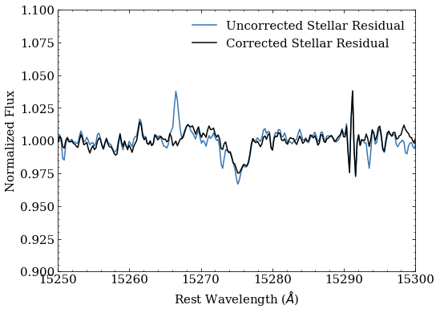
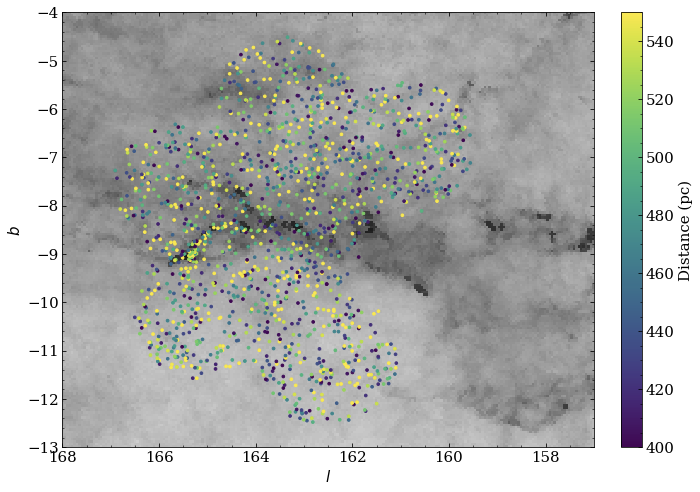
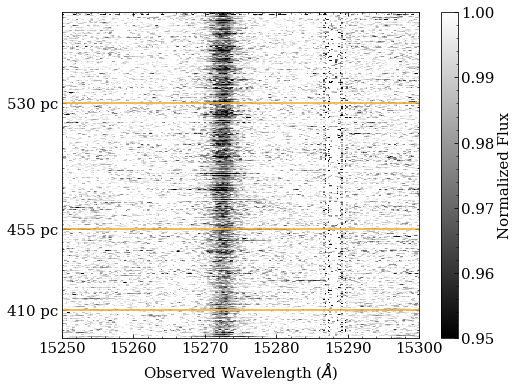

# Readme

## ASPCAP Residual Models

As a tool for correcting systemic discrepancies between ASCPAP models and observed stellar spectra, we produced a catalog of median stellar residuals as a function of effective temperature, log g, and metallicity. ASPCAP residuals can be divided by the appropriate residual model to remove small remaining artifacts of model mismatch to data.

Input APOGEE stars were selected to have relatively low uncertainties in TEFF, LOGG, and M_H, without ASPCAPFLAGs STAR_BAD or CHI2_BAD set, and with | GLAT | > 10° in order to avoid regions of high extinction (and thus strong DIBs). These stars were then grouped by TEFF, LOGG, and M_H according to the binning scheme used by [Ashok et al. (2021)](https://iopscience.iop.org/article/10.3847/1538-3881/abd7f1): 

TEFF: ΔTEFF = 50 K for 3000 K < TEFF < 5000 K and ΔTEFF = 150 K for 5000 K < TEFF < 10,000 K.

LOGG: ΔLOGG = 0.2 dex for -1 < LOGG < 5. 

M_H: ΔM_H = 0.3 dex for − 2.3 < M_H < − 1.1 and ΔM_H = 0.2 dex for − 1.1 < M_H < + 0.5.

Within each bin, ASPCAP residuals were masked to ignore pixels with large uncertainties or most APOGEE_PIXMASK flags set. Files containing the pixel-wise median, standard deviation, and other statistics for each bin are available [here](https://drive.google.com/file/d/1Xi9358vslHVCtdlQfjuPhUOtfC0u-0WP/view); the accompanying `meta.fits` table describes bin boundaries, residual-wise statistics, and corresponding filenames.

__How to use:__ An example of choosing the appropriate median residual for a given set of stellar parameters and applying the correction to an ASPCAP residual is available in this [jupyter notebook.](https://drive.google.com/file/d/186BLVYwTjqGtVQ0N1TBRMh9tPiTnVyiR/view)

Above: an ASPCAP stellar residual with and without correction by its corresponding median binned residual. 

## California Cloud ISM Spectra
As an exploratory SDSS-IV sample for the [MWM Dust carton](https://wiki.sdss.org/display/OPS/Cartons+for+v1.0), stars were targeted towards the California Cloud in order to fill in the region with a spatial resolution of roughly 100 pc. This sample density will allow for the characterization of localized ISM structures and kinematics using kinetic tomography. 

Above: APOGEE stars with California Cloud fields, plotted over the Bayestar19 extinction map for the region ([Green et al. 2019](https://ui.adsabs.harvard.edu/abs/2019ApJ...887...93G/abstract)).

Using the ASPCAP spectra and the residual model to remove the stellar contribution from each spectrum, we calculated ISM spectra for the California Cloud stars, available [here](https://drive.google.com/file/d/1P7lb6ahZLKVI4pa_0-Ca-212Iz_NypTX/view). Each file is named by APOGEE_ID and contains corrected and uncorrected stellar residuals interpolated to a common array of observed wavelengths. The accompanying `CA_meta.fits` table includes individual stellar parameters, filenames and some residual-level statistics.

Above: color map of median-corrected ASCPAP residuals towards the California Cloud, ordered by distance. Approximate positions of the nearest extent (410 pc), central bubble (455 pc), and furthest extent of the cloud from [Rezaei Kh. & Kainulainen (2022)](https://ui.adsabs.harvard.edu/abs/2022ApJ...930L..22R/abstract) are marked in orange. Note that the strength of the 15272.4 Å DIB increases with distance.

### Links to external resources:
[Catalog of model residuals as a function of stellar parameters](https://drive.google.com/file/d/1Xi9358vslHVCtdlQfjuPhUOtfC0u-0WP/view)

[Model residual quick-start example (Jupyter notebook)](https://drive.google.com/file/d/1Xi9358vslHVCtdlQfjuPhUOtfC0u-0WP/view)

[California Cloud ISM spectra](https://drive.google.com/file/d/1P7lb6ahZLKVI4pa_0-Ca-212Iz_NypTX/view)

